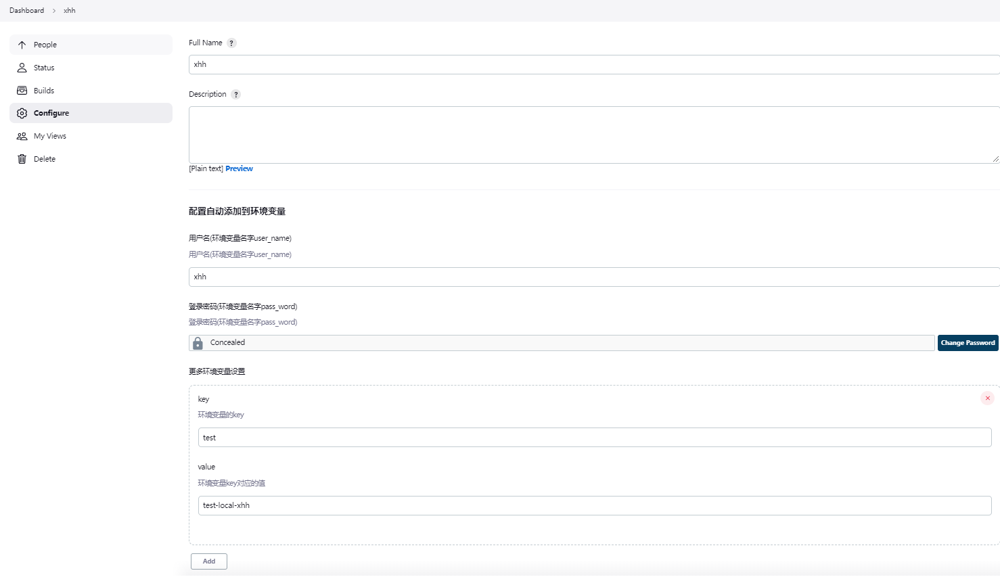
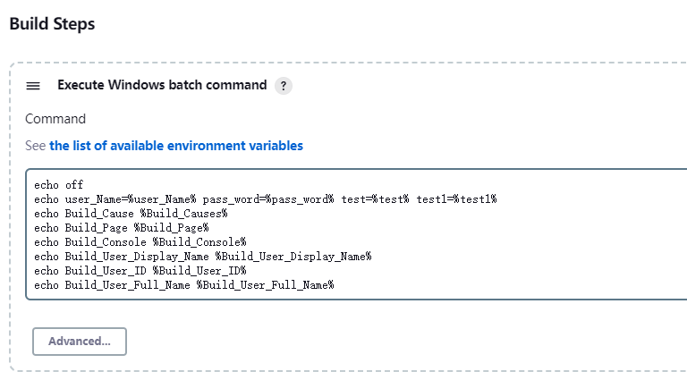
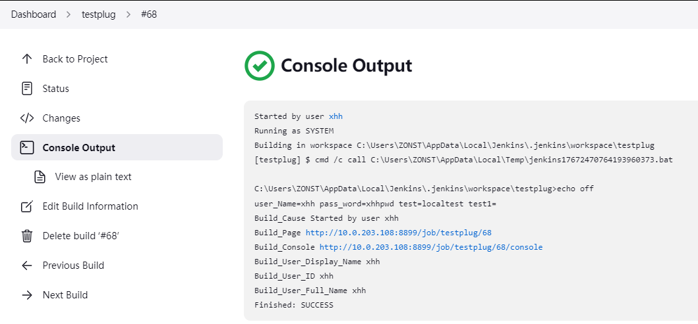
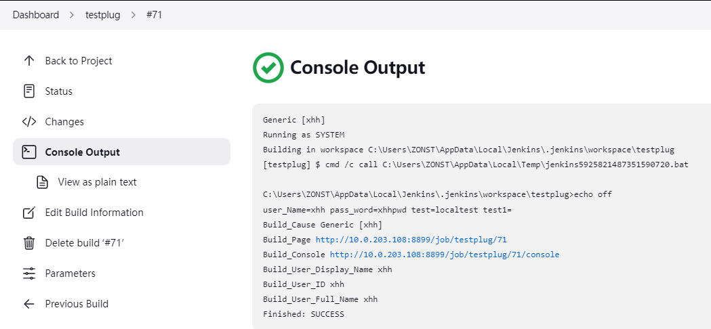
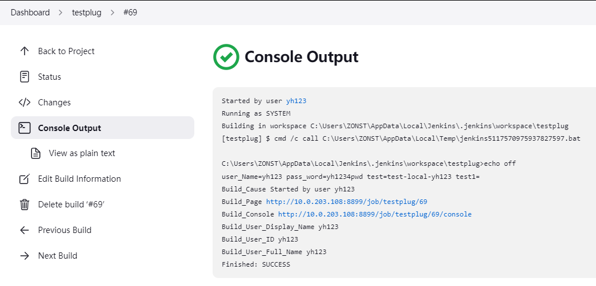
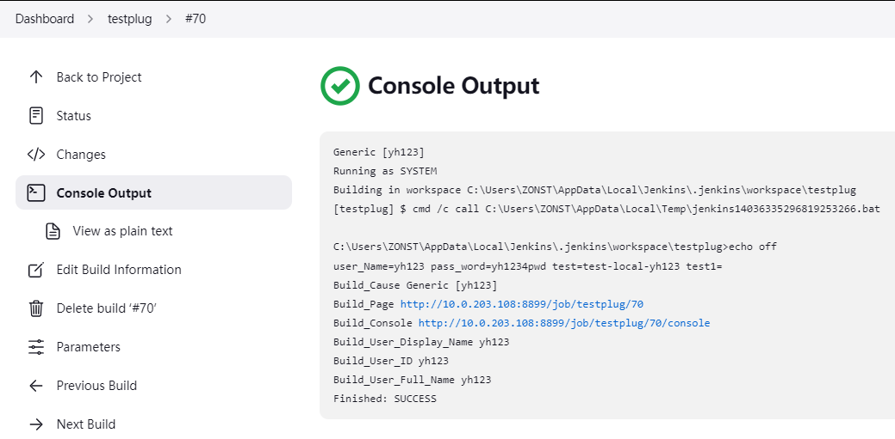
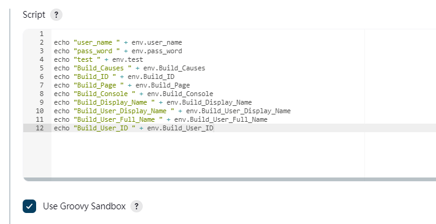
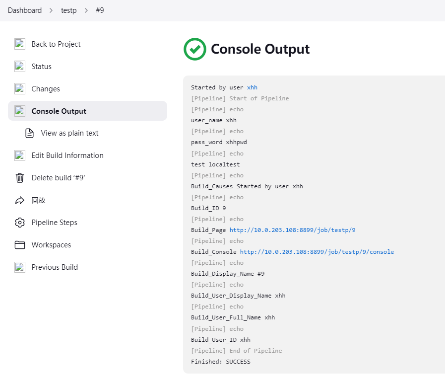
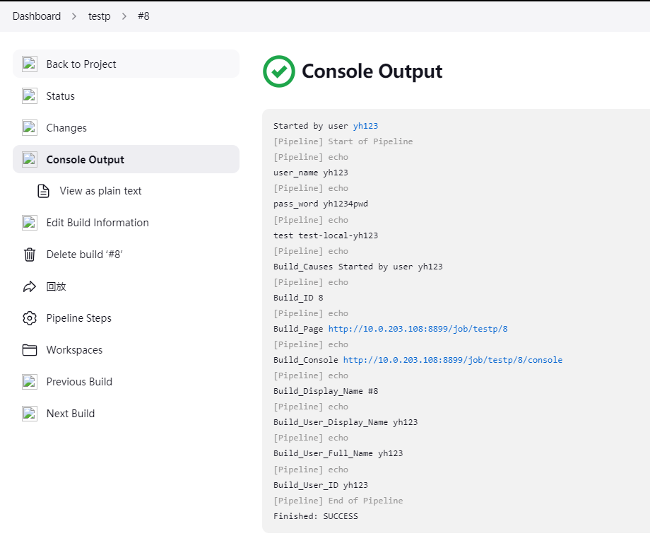

# ConfigEnvironmentInjector

## Introduction
- You can also customize some variables for your build tasks 
- The plugin presets some variables for your build tasks
- If you set the global environment variable of the plugin and the user's environment variable, the environment variable set by the same environment variable user will override the global environment variable. If you set the global environment variable that comes with Jenkins
- 您还可以为构建任务自定义一些变量
- 该插件为您的构建任务预设了一些变量
- 如果设置插件的全局环境变量和用户的环境变量，同一个环境变量用户设置的环境变量会覆盖全局环境变量
## Getting started

###The plugin provides the following environment variables:
###该插件提供以下环境变量：

| Variable                  | Description                           |
| ------------------------  | ----------------------------------    |
| Build\_Causes             | Build_Causes                          |
| Build\_Page               | Current build page address            |
| Build\_Console            | Current build Console address         |
| Build\_User\_Display\_Name| User DisplayName                      |
| Build\_User\_Full\_Name   | User FullName                         |
| Build\_User\_ID           | User ID                               |
| Build\_User\_Email        | User Email address                    |

| 变量                       | 说明                                   |
| ------------------------  | ----------------------------------     |
| Build\_Causes             | Build_Causes                           |
| Build\_Page               | 当前构建页面地址                          |
| Build\_Console            | 当前构建控制台地址                         |
| Build\_User\_Display\_Name| 用户显示名                               |
| Build\_User\_Full\_Name   | 用户全名                                 |
| Build\_User\_ID           | 用户名                                   |
| Build\_User\_Email        | 用户电子邮件地址                          |
## Fix coverage issues
- g_key you set the global environment variable
- The final result of key

- g_key 你设置全局环境变量
- key 最终结果

## Usage example

## If you are using the Generic Webhook Trigger to trigger the project build
- You can set Cause to trigger the acquisition of environment variables of different users. If the value in the brackets in [value] is equal to the environment variable set by a user, the environment variable used for project construction will use the environment variable of the matched player. The above Image instance, where value can be a fixed value or a variable obtained by Generic Webhook Trigger, set with $xxxx, such as [$pushUserName]
## 如果你是用 Generic Webhook Trigger 触发项目构建
- 你可以设置Cause来触发获取不同用户的环境变量，[value]中括号里面的value如果等于某个用户设置的环境变量来，则项目构建用的环境变量会使用匹配到的玩家的环境变量，上面图片实例，其中value 可以是固定的值或者是Generic Webhook Trigger获取的变量，采用$xxxx来设置，比如[$pushUserName]

Licensed under MIT, see [LICENSE](LICENSE.md)

